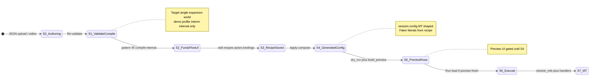

# Plan: Every “name” path in the app + how to consolidate

This document inventories **all** disparate pipelines for actor keys, human labels, slot wiring, template placeholders, hydrated resource names, and UI display strings — then maps each to a **consolidation** approach. It supersedes a shorter earlier sketch.

**Start here for product/engineering direction:** **§0.5 (locked decisions)** and **§17 (backlog NW-1–NW-8)**. **§18** — net **LoC** delete assessment and **two-state vs clandestine** pipeline analysis. **§19** — **deletion register** (every helper/symbol targeted for removal or merge).

---

## 0) Vocabulary (do not conflate)

| Concept            | Meaning                                      | Example                                                         |
| ------------------ | -------------------------------------------- | --------------------------------------------------------------- |
| **Frame key**      | Dict key under `funds_flows[].actors`        | `user_1`, `direct_1`                                            |
| **Human alias**    | `ActorFrame.alias` — story label             | `Buyer`, `Platform`                                             |
| **Slot binding**   | `flatten_actor_refs` entry                   | key `user_1.bank` → `$ref:external_account.…`                   |
| **Pre-actor**      | `@actor:frame.slot` before compile           | Resolved in `resolve_actors`                                    |
| **Profile keys**   | String map for `deep_format_map` / templates | `{user_1_business_name}`, `{instance}`                          |
| **Hydrated name**  | Field on an emitted resource config          | `legal_entity.business_name`, `counterparty.name`, `party_name` |
| **Preview label**  | Row in `preview_items`                       | `display_name`, `mt_display_name`                               |
| **Ref slug label** | Heuristic from `$ref:` string                | `actor_display_name` in `mermaid.py` — **legacy fallback only**; user-facing surfaces use shared MT-name resolver (§0.5) |

---

## 0.5) Locked product & engineering decisions (2026-04)

These override earlier “optional” or “two world” wording elsewhere in this doc until implementation catches up.

| Decision | Rule |
|----------|------|
| **Preview before Apply** | **Not allowed.** Operators do not open **Execution plan / Preview** until **Apply** (compose) has run. UI: **grey out / disable** the Preview entry (cannot navigate there). |
| **Single source of MT-shaped truth** | `session.config` **after compose** is the **only** contract for payloads that match what **Execute** sends to MT. **`preview_items`** = projection of that config for humans (`extract_display_name` + reconciliation → `display_name` / `mt_display_name`). |
| **One expansion world** | **Consolidate** validate-time **demo** expansion (`pass_expand_instances` `default_profile`) with recipe-driven expansion long-term; short term, **gating Preview** removes user-facing confusion. **No** permanent “two truths” for names the operator trusts. |
| **One display pipeline (target)** | **Ideally one** resolver for “label for this `$ref:` / `typed_ref`” across app. **Maximum two** only if strongly justified and documented. **Mermaid, fund-flow ledger/payments views, grouped preview, case-card participants** must use the **same** labels as MT-facing resource names (same pipeline as preview rows), **not** `actor_display_name` / alias+slot maps. |
| **Preview / Execution plan** | For resources on that page: **`preview_items` + `typed_ref` only** — no parallel `actor_display_name` or authoring-only labels. |
| **Grouped preview actor strip** | Each actor binding shows the **MT resource name** as it will appear in MT (via preview row resolution / `mt_display_name` rules), **not** `frame.slot` masquerading as `alias`. See [`PLAN_ACTOR_PREVIEW_RESOLUTION.md`](PLAN_ACTOR_PREVIEW_RESOLUTION.md). |
| **Case card participants** | Always **names as they will appear in MT** (post-compose hydrated / same resolver as preview), not DSL variables or slot paths. |
| **Execute vs preview freshness** | If config changes after the last **`build_preview`**, **block Execute** until preview is rebuilt (re-apply or explicit “refresh preview” that re-runs dry_run + `build_preview`). |

**Backlog slotting:** see **§17**.

---

## 1) Authoring input (JSON / DSL / prompts)

| Location                                             | What “name” means          | Wired to                                                              |
| ---------------------------------------------------- | -------------------------- | --------------------------------------------------------------------- |
| `funds_flows[].actors` keys                          | Frame keys                 | `@actor:{key}.{slot}`, `actor_overrides[{key}]`, profile `{key}_*`    |
| `ActorFrame.alias`                                   | Human label (DSL / intent) | Scenario builder chip, authoring UX — **not** an MT display name; MT labels come from shared resolver post-compose (§0.5) |
| `ActorFrame.slots`                                   | `$ref:` targets            | `flatten_actor_refs`, validation, views                               |
| `ActorFrame.entity_ref`                              | LE anchor for user frames  | Instance LE rows after expansion                                      |
| `ActorFrame.customer_name`                           | Literal for direct frames  | Profile literals; UI in scenario builder / drawer                     |
| `ActorFrame.dataset`, `name_template`, `entity_type` | Faker / template choice    | `_build_instance_profile`                                             |
| `instance_resources` templates                       | Placeholders in JSON       | `deep_format_map` + `_bind_bare_business_name`                        |
| `trace_value_template`                               | Trace string               | See §3 (compile has a second expansion path)                          |
| Step payloads                                        | `@actor:` / `$ref:`        | `resolve_actors` in `compile_flows`                                   |
| `DataLoaderConfig.customer_name`                     | Top-level branding (legacy) | **Target:** same shared label pipeline as other surfaces — see §5 / §0.5 |

**Consolidation:** Treat **frame key**, **alias**, and **slot path** as three explicit fields everywhere we serialize actors for UI (today one field is overloaded as `alias` in grouped preview — §7).

---

## 2) Validate-time compiler pipeline (`compile_to_plan`)

| Pass                 | File                                                | Name-related behavior                                                                                                                                                  |
| -------------------- | --------------------------------------------------- | ---------------------------------------------------------------------------------------------------------------------------------------------------------------------- |
| **expand instances** | `flow_compiler/pipeline.py` `pass_expand_instances` | Uses **hardcoded** `default_profile` (`Demo Corp`, `Demo`, `User`, …) — **not** Faker, **not** recipes. Expands `instance_resources` with `instance="0000"`.           |
| **compile → IR**     | `flow_compiler/core.py` `compile_flows`             | `flatten_actor_refs` + `resolve_actors`; `expand_trace_value(template, flow.ref, 0)` with `**instance` int `0`** unless template was already fully substituted earlier |
| **emit**             | `emit_dataloader_config`                            | Resources land in `config` with whatever names the expanded templates had                                                                                              |
| **Mermaid**          | `pass_render_diagrams`                              | `render_mermaid(ir, fc, customer_name=authoring.config.customer_name)`                                                                                                 |
| **Fund flow views**  | `pass_compute_view_data`                            | `compute_view_data` → `build_ref_display_map` / `resolve_actor_display` (alias + slot, not hydrated config)                                                            |

**Consolidation (§0.5):**

- **Single expansion world (target):** Remove reliance on **`default_profile` demo strings** for any user-trusted path. **Short term:** Preview is **gated until Apply**, so operators never audit demo-expanded names as “MT truth.” **Long term:** Drive `pass_expand_instances` from the **same profile machinery** as `generate_from_recipe` when recipes exist, or use **schema-minimal** placeholders that are explicitly non-MT (internal compile-only), then **one** compose path produces real names.
- **`expand_trace_value(..., instance=0)` in `compile_flows`:** Still clarify contract vs `deep_format_map` — part of the same consolidation pass.

---

## 3) Generation / scenario apply (`generate_from_recipe`, `_compose_all_recipes`)

| Stage                | File                                                    | Name-related behavior                                                                                                                                                |
| -------------------- | ------------------------------------------------------- | -------------------------------------------------------------------------------------------------------------------------------------------------------------------- |
| Recipe               | `models/flow_dsl.py` `GenerationRecipeV1`               | `actor_overrides[frame_key]` → `customer_name`, `name_template`, `dataset`, `entity_type`                                                                            |
| Profile              | `flow_compiler/generation.py` `_build_instance_profile` | Per frame: literals or Faker via `seed_loader`; keys `{alias}_name`, `{alias}_business_name`, `{alias}_*`; first actor seeds legacy `business_name`, `first_name`, … |
| Clone                | `clone_flow`                                            | `deep_format_map` entire flow dict including `ref`, `trace_value_template`, steps                                                                                    |
| Instance resources   | `_expand_instance_resources`                            | Same profile; `_bind_bare_business_name` ties bare `{business_name}` to matching `entity_ref` stem                                                                   |
| Compile per instance | `compile_flows(flows, base_config)`                     | Each flow `ref` like `pattern__0042`                                                                                                                                 |
| Mermaid per instance | `generation.py`                                         | `render_mermaid(ir, flow_config)` — **no** `customer_name=` passed → **defaults to `"direct"`** (unlike validate pipeline)                                           |

**Consolidation (§0.5):**

- **Mermaid + diagrams:** Stop using **separate** `_build_ref_display_map` / `actor_display_name` for user-visible labels — **reuse** the same **`preview_items` / config + `extract_display_name`** pipeline (or a shared `resolve_mt_display_label(typed_ref)` used by preview, Mermaid, and fund-flow views). Eliminates parallel naming code when values already exist on resources.
- Keep **one profile builder** (`_build_instance_profile`) as the single place that defines `{frame}_`* keys for **composed** loads; document legacy mirror keys (`business_name`, …) as compatibility-only.

---

## 4) Session state handover

| Field                                        | Name-related role                                                               |
| -------------------------------------------- | ------------------------------------------------------------------------------- |
| `authoring_config_json`                      | Original patterns + `funds_flows` + `instance_resources`                        |
| `config` / `config_json_text`                | Executable resources; **hydrated** names live here                              |
| `generation_recipes`                         | Overrides that change Faker/literals                                            |
| `pattern_flow_ir` / `pattern_expanded_flows` | Snapshot from **validate** (demo profile expansion)                             |
| `flow_ir` / `expanded_flows`                 | After apply: **one IR + expanded flow per generated instance**                  |
| `_display_flow_session_sources`              | If `generation_recipes` **and** `flow_ir`: show **generated**; else **pattern** |
| `preview_items`                              | Built from **current** `config` + DAG + reconciliation                          |
| `view_data_cache`                            | Recomputed on apply: `compute_view_data(ir, fc)` per pair                       |

**Consolidation (§0.5):** After **Apply**, **`flow_ir` / `expanded_flows` / `view_data_cache` / `preview_items`** should all reflect the **same** composed config. **Preview** is unreachable before Apply. Document **`pattern_*`** fields only as **pre-apply compile artifacts** (internal / `/flows` structural validation), not as MT-audit surfaces.

---

## 5) Display pipelines (many — this is the messy core)

### 5a) Resource row labels (Setup / Preview tables)

| Source        | Mechanism                                                                                                                             |
| ------------- | ------------------------------------------------------------------------------------------------------------------------------------- |
| Config object | `dataloader/engine/resource_display.py` `extract_display_name` — per-`resource_type` attrs (`name`, `business_name`, `party_name`, …) |
| Preview row   | `dataloader/helpers.py` `build_preview` sets `display_name` / `mt_display_name` (reconciliation merges **discovered** names from org) |
| Template      | `templates/partials/preview_resource_row.html` prefers `mt_display_name` else `display_name`, else typed ref tail                     |

**Consolidation (§0.5):** **Canonical** path for **Execution plan / Preview** — page is **only reachable after Apply**, so rows always reflect **composed** config. Extend this pipeline to Mermaid + fund-flow views via a **shared resolver**.

### 5b) “Resolve a `$ref:` string to a string” without preview row

| Source                                    | Mechanism                                                                                                        |
| ----------------------------------------- | ---------------------------------------------------------------------------------------------------------------- |
| `preview_labels.resolve_resource_display` | Walk `typed_ref` variants on `all_resources(config)` → `display_label_from_resource` → else `actor_display_name` |

Used in tests and any code importing `resolve_resource_display` from helpers.

**Consolidation (§0.5):** Implement **one** internal `resolve_mt_display_label(ref, preview_by_typed, config)` used here, grouped preview, Mermaid, and fund-flow views — **preview row first** (`mt_display_name` / `display_name`), else `extract_display_name` on config, else last-resort slug.

### 5c) Ref-slug pretty-print (no config lookup)

| Source                                          | Mechanism                                                                 |
| ----------------------------------------------- | ------------------------------------------------------------------------- |
| `flow_compiler/mermaid.py` `actor_display_name` | `$ref:internal_account.ops_usd` → title-cased slug, strip currency, CP→EA |

**Consolidation (§0.5):** **Last-resort fallback only** inside the shared resolver — not a parallel user-facing convention.

### 5d) Mermaid sequence diagrams

| Source                                          | Mechanism                                                                                    |
| ----------------------------------------------- | -------------------------------------------------------------------------------------------- |
| `_build_ref_display_map(actors, customer_name)` | **Current (wrong per §0.5):** `ActorFrame.alias` + slot + `actor_display_name` fallback       |
| Arrows                                          | `_resolve_actor_display` → slug fallback                                                    |

**Consolidation (§0.5):** **Remove** alias+slot as the display source for participants. **Replace** with the **same** resolver as preview: map each account `$ref` → `preview_items` row (or `extract_display_name` on the resource in `session.config`). **Delete or shrink** `_build_ref_display_map` for display purposes once shared helper exists.

### 5e) Fund Flow ledger / payments views (`compute_view_data`)

| Source              | Mechanism                                                                                                |
| ------------------- | -------------------------------------------------------------------------------------------------------- |
| Column headers      | **Current:** `build_ref_display_map` + `resolve_actor_display` — **wrong per §0.5**                    |
| `account_actor_map` | `$ref:` → `frame.slot` (inverse `flatten_actor_refs`) — OK for **binding** metadata, not for **display**   |

**Consolidation (§0.5):** Column **`display_name`** must come from the **shared MT-name resolver** (same as Mermaid + preview). Keep `account_actor_map` only if needed for **wiring** (frame.slot → ref), not for human labels.

### 5f) Grouped preview “Actors” strip

| Source                       | Mechanism                                                                                                                                        |
| ---------------------------- | ------------------------------------------------------------------------------------------------------------------------------------------------ |
| `build_flow_grouped_preview` | **Current (wrong):** dict key `alias` = `frame.slot`; no MT-facing label                                                                         |
| Template                     | `preview_flows_page.html` mislabels slot path as “actor-alias”                                                                                    |

**Consolidation (§0.5):** **Required:** show **MT resource name** (same rule as `preview_resource_row.html`: `mt_display_name` if set, else `display_name`) for each actor slot `$ref`, via `preview_items` + typed-ref walk — [`PLAN_ACTOR_PREVIEW_RESOLUTION.md`](PLAN_ACTOR_PREVIEW_RESOLUTION.md). Rename keys: e.g. `frame_slot`, `mt_display_label`.

### 5g) Flows list / drawer / scenario builder

| Source                      | Mechanism                                                                      |
| --------------------------- | ------------------------------------------------------------------------------ |
| `flows_page` `actors_list`  | Intent / DSL labels (`frame.alias`, etc.) — OK **on /flows** for configuration |
| `flows_page` `actor_frames` | **Bug:** `alias` = frame key — fix for **case card**                           |
| `flow_drawer`               | Uses `frame.alias` — OK for **intent**; **participant summary** → MT names (§0.5) |
| `scenario_builder.html`     | `frame_name`, chip `alias`, `actor_overrides` — **intent** surface              |
| `flows_view.html`           | `actor_aliases` = frame keys for **template hint** variables only               |

**Consolidation (§0.5):** **Case card “participants” / overview** → **MT names** (shared resolver, post-compose). **Drawer chip `alias`** may remain for **story role** only if product wants both; if **one** string only, use **MT name** only.

### 5h) Org discovery + reconciliation

| Source                  | Mechanism                                                                      |
| ----------------------- | ------------------------------------------------------------------------------ |
| `org/discovery.py`      | `_le_display_name`, `_le_display_name_from_sdk`                                |
| `org/reconciliation.py` | `discovered_name` per match type; matching keys use normalized `business_name` |
| `build_preview`         | `mt_display_name` prefers discovered name for matched/update actions           |

**Consolidation:** Keep reconciliation as **runtime** overlay on top of config names; do not duplicate LE naming logic outside `_le_display_name` + `extract_display_name`.

### 5i) Execute / SSE

| Source                        | Mechanism                                                                 |
| ----------------------------- | ------------------------------------------------------------------------- |
| `dataloader/engine/runner.py` | SSE payloads include `display_name` from `extract_display_name(resource)` |

**Consolidation:** Already aligned with resource_display; ensure any new name fields follow same helper.

### 5j) DB / drafts

| Source                   | Mechanism                                                                                                    |
| ------------------------ | ------------------------------------------------------------------------------------------------------------ |
| `db/tables.py`           | `display_name` column on some rows                                                                           |
| `models/loader_draft.py` | Persists `generation_recipes`, pattern fields — recipes affect future hydration, not stored “names” directly |

**Consolidation:** Treat DB `display_name` as execution/run metadata, not authoring alias.

### 5k) Diagnostics / IR-only

| Source                | Mechanism                                      |
| --------------------- | ---------------------------------------------- |
| `compile_diagnostics` | Aggregates `trace_value` strings from `FlowIR` |
| `flow_account_deltas` | Amounts per account ref — not display names    |

### 5l) Runs, cleanup, staged firing (ref-first UIs)

| Source                                                         | Mechanism                                                                                  |
| -------------------------------------------------------------- | ------------------------------------------------------------------------------------------ |
| `templates/run_detail.html`, `staged_row.html`, `cleanup.html` | Primary visible identifier is `**typed_ref`** (and slug split), not `extract_display_name` |
| Webhook partials                                               | `typed_ref` + MT ids                                                                       |

**Consolidation:** These screens are **execution/debug** surfaces; optional enhancement is to join the same `display_name` used in preview when building run resource rows — today that is a **separate** presentation path from Setup preview.

### 5m) Discovery summary (live org)

| Source                                      | Mechanism                                                              |
| ------------------------------------------- | ---------------------------------------------------------------------- |
| `templates/partials/discovery_summary.html` | Shows **discovered** `vendor_name`, `ia.name`, `lg.name`, etc. from MT |

**Consolidation:** This is **fourth-party truth** (production org), orthogonal to config hydration; only intersects via **reconciliation** → `build_preview` / `mt_display_name`.

---

## 6) Client-side (scenario builder JS)

| Area                            | Behavior                                                                                                 |
| ------------------------------- | -------------------------------------------------------------------------------------------------------- |
| `static/js/scenario-builder.js` | Posts `actor_overrides` keyed by **frame**; `customer_name`, `entity_type`, `dataset`, `name_template`   |
| Inline vs drawer                | Some flows use `.actor-customer-name` on main row; drawer uses different class names — both hit same API |

**Consolidation:** No separate name engine in JS — good. Keep frame key as sole wire key.

---

## 7) Consolidation matrix (problem → tactic)

| Problem | Tactic (§0.5) |
| ------- | ------------- |
| Preview reachable before Apply | **Gate UI** (grey/disable Execution plan → Preview); server may still 302 or reject `/preview` if `!preview_ready` flag. |
| Two expansion worlds (demo vs recipe) | **Gate** + **merge** `pass_expand_instances` toward recipe/shared profile (follow-up). |
| Parallel display pipelines (Mermaid, views, grouped actors, preview) | **One** `resolve_mt_display_label` (preview row → config → slug); **remove** display use of `_build_ref_display_map` / `actor_display_name` for user-visible strings. |
| Grouped preview actor strip wrong | **MT name** from `preview_items` per `PLAN_ACTOR_PREVIEW_RESOLUTION`; rename keys. |
| Case card participants wrong | **MT names** via shared resolver; fix `actor_frames` bug if still used. |
| Execute vs stale preview | **`config_hash` or revision** vs last `build_preview` timestamp; block Execute + message until refresh. |
| Tests forbid `display_label` on actors | **Update** tests to require `mt_display_label` (or equivalent) populated when preview exists. |

---

## 8) Suggested implementation order

1. **Session flag + UI gate:** `preview_allowed` / `has_applied_compose` (or derive: non-empty composed `preview_items` after apply only) — disable Preview chrome on `/flows`, `/setup`; optional guard on `GET /preview`.
2. **Preview freshness for Execute:** store `preview_build_config_hash` (or reuse `config_hash` from [`run_meta`](../dataloader/engine/run_meta.py)) at `build_preview` time; Execute route checks match.
3. **Shared resolver module:** e.g. `resolve_mt_display_label($ref, preview_by_typed, resource_map)` in `dataloader/preview_labels.py` or `dataloader/engine/` — **single** implementation.
4. **Grouped preview actors:** use resolver in `build_flow_grouped_preview`; update `preview_flows_page.html`; fix tests.
5. **Mermaid:** replace `_build_ref_display_map` display map with resolver (needs `preview_items` or `config` passed into `render_mermaid`).
6. **`compute_view_data` / fund-flow views:** column `display_name` from resolver; keep `account_actor_map` for wiring only.
7. **Case cards / drawer participant summary:** MT names from resolver (post-compose).
8. **Compiler consolidation:** replace `default_profile` in `pass_expand_instances` with shared/recipe-aware expansion (larger; after 1–7).

---

## 9) File index (quick navigation)

| Area                     | Files                                                                                                   |
| ------------------------ | ------------------------------------------------------------------------------------------------------- |
| DSL models               | `models/flow_dsl.py`, `models/config.py`                                                                |
| Actor ref resolution     | `flow_compiler/core.py`                                                                                 |
| Demo expansion           | `flow_compiler/pipeline.py`                                                                             |
| Faker / profile          | `flow_compiler/generation.py`, `flow_compiler/seed_loader.py`                                           |
| Mermaid display          | `flow_compiler/mermaid.py`, `flow_compiler/display.py`                                                  |
| Fund flow views          | `flow_compiler/flow_views.py`                                                                           |
| Preview                  | `dataloader/helpers.py`, `dataloader/preview_labels.py`, `templates/partials/preview_resource_row.html` |
| Resource names           | `dataloader/engine/resource_display.py`                                                                 |
| Routes / session         | `dataloader/routers/flows.py`, `dataloader/routers/setup.py`, `dataloader/session/__init__.py`          |
| Org names                | `org/discovery.py`, `org/reconciliation.py`                                                             |
| Execute SSE              | `dataloader/engine/runner.py`                                                                           |
| Scenario UI              | `templates/partials/scenario_builder.html`, `static/js/scenario-builder.js`                             |
| Prior actor preview plan | `docs/PLAN_ACTOR_PREVIEW_RESOLUTION.md`                                                                 |

---

## 10) Target flow (this doc’s “diff”): Funds Flow UI → recipe / staging / Faker → Preview → resources → MT

Everything in §1–§9 is the **inventory of problems**. This section is the **single spine** we want after consolidation: same identifiers and labels should be explainable from one diagram.

### 10.1 States and artifacts

| State     | User-facing surface                         | Canonical stored shape                                         | “Name” lives in |
| --------- | ------------------------------------------- | -------------------------------------------------------------- | ---------------- |
| **S0**    | Setup editor                                | Raw JSON text                                                  | DSL variables, `actors`, templates |
| **S1**    | (internal) validate compile                 | Emitted `config` from `compile_to_plan`                      | Interim demo expansion — **not** shown on gated Preview (§0.5) |
| **S2**    | `/flows` dashboard                          | Recipes, bindings, pattern IR for structure                    | **Intent** labels where needed; **participant summary** → **MT names** after S4 only |
| **S3**    | Scenario / Flow config bands                | `generation_recipes`                                           | Recipe + `actor_overrides` / future library bindings |
| **S4**    | Apply                                       | `session.config` = merged composed load                        | **Hydrated** resource name fields = MT payload names |
| **S5**    | Execution plan / Preview (**after S4 only**) | `preview_items[]` from `build_preview`                        | `display_name`, `mt_display_name` — **sole** resource labels on this page |
| **S6–S7** | Execute (if preview fresh) → MT             | Run + API                                                      | Same strings as S4/S5 |

### 10.2 Where the plan document **diffs** current behavior

| Topic | Today | Target (§0.5) |
| ----- | ----- | ------------- |
| Preview before Apply | Allowed; shows demo-expanded names if user navigates | **Blocked** in UI; optional server guard |
| Actor strip / Mermaid / fund-flow columns | Alias+slot / slug | **Shared MT-name resolver** from `preview_items` + config |
| Execute stale config | Allowed | **Blocked** until preview rebuilt |
| Compiler expansion | Demo profile vs recipe | **One world** (gate + then merge `pass_expand_instances`) |

---

## 11) Variable → value mapping (recipe / Faker spine)

Bindings below are the **intended** mental model; line refs point to implementing code.

| Placeholder / key                                      | Set by                                      | Typical value                                           | Woven into (resources)                                    |
| ------------------------------------------------------ | ------------------------------------------- | ------------------------------------------------------- | --------------------------------------------------------- |
| `{instance}`                                           | `clone_flow` / `_expand_instance_resources` | `0000`, `0001`, …                                       | `ref` fields, flow `ref`, typed step refs                 |
| `{ref}`                                                | `clone_flow` mapping                        | `pattern__0001`                                         | `trace_value_template`, metadata                          |
| `{<frame_key>_business_name}`, `{<frame_key>_name}`, … | `_build_instance_profile` + `seed_loader`   | Faker or literal from `customer_name` / `name_template` | `instance_resources` strings → LE/CP/EA/IA name fields    |
| `{business_name}`, `{first_name}`, … (legacy)          | `_build_instance_profile` `setdefault`      | Mirror of **first** actor’s profile                     | Same templates if not actor-scoped                        |
| `ActorFrame.alias`                                     | Author                                      | `Buyer`                                                 | DSL / **intent** only — **not** the MT display string (§0.5) |
| `ActorFrame.customer_name`                             | Author or `actor_overrides`                 | `Acme Corp`                                             | Profile literals → same as template output                |
| `preview_items[].display_name`                         | `build_preview` → `extract_display_name`    | From final `config` resource                            | Preview UI, resource row                                  |
| `preview_items[].mt_display_name`                      | `build_preview` + reconciliation            | Config name or **discovered** name                      | Preview row primary label; chips for matched/update       |

**Staging (recipe):** `select_staged_instances` / `mark_staged` in `[flow_compiler/generation.py](../flow_compiler/generation.py)` set `step["staged"]` on money-movement steps for selected instance indices; that flows into the same `config` objects that `build_preview` and handlers read — **no separate name pipeline**, but staged rows get a **staged** chip in `[preview_resource_row.html](../templates/partials/preview_resource_row.html)`.

---

## 12) Transitions — functions / tools (line anchors)

| #   | From → To                                | Primary functions                                                           | File (approx lines)                                                                                                                  |
| --- | ---------------------------------------- | --------------------------------------------------------------------------- | ------------------------------------------------------------------------------------------------------------------------------------ |
| T1  | Raw JSON → emitted `DataLoaderConfig`    | `compile_to_plan` → `STANDARD_PIPELINE`                                     | `[flow_compiler/pipeline.py](../flow_compiler/pipeline.py)` 208–227                                                                  |
| T2  | Pattern + demo profile → expanded flows  | `pass_expand_instances`                                                     | `[flow_compiler/pipeline.py](../flow_compiler/pipeline.py)` 99–136                                                                   |
| T3  | `@actor:` → `$ref:`                      | `flatten_actor_refs`, `resolve_actors`                                      | `[flow_compiler/core.py](../flow_compiler/core.py)` 42–70, 360+                                                                      |
| T4  | Template strings → literal names in JSON | `deep_format_map`, `_expand_instance_resources`, `_bind_bare_business_name` | `[flow_compiler/generation.py](../flow_compiler/generation.py)` 41–107                                                               |
| T5  | Recipe + pattern → N instances + Faker   | `generate_from_recipe`, `_build_instance_profile`, `clone_flow`             | `[flow_compiler/generation.py](../flow_compiler/generation.py)` 429–492, 495–656                                                     |
| T6  | Staging selection                        | `select_staged_instances`, `mark_staged`                                    | `[flow_compiler/generation.py](../flow_compiler/generation.py)` 353–402, 528–602                                                     |
| T7  | Session updated after apply              | `_recompose_and_persist_session`                                            | `[dataloader/routers/flows.py](../dataloader/routers/flows.py)` 268–327                                                              |
| T8  | Config → DAG → preview rows              | `dry_run`, `build_preview`                                                  | `[dataloader/routers/setup.py](../dataloader/routers/setup.py)` 245–262; `[dataloader/helpers.py](../dataloader/helpers.py)` 165–256 |
| T9  | Grouped preview / actor rows             | `build_flow_grouped_preview`                                                | `[dataloader/preview_labels.py](../dataloader/preview_labels.py)` 88–181                                                             |
| T10 | Fund flow ledger/payments columns        | `compute_view_data`, `build_ref_display_map`, `resolve_actor_display`       | `[flow_compiler/flow_views.py](../flow_compiler/flow_views.py)` 150–210, 454–526                                                     |
| T11 | Persist continuity                       | `loader_draft_from_session`, `persist_loader_draft`                         | `[dataloader/session/draft_persist.py](../dataloader/session/draft_persist.py)` 19–37, 81–98                                         |
| T12 | Config resource → MT API                 | `resolve_refs` → handler `**resolved`                                       | `[dataloader/handlers/operations.py](../dataloader/handlers/operations.py)` (e.g. `create_legal_entity` 194–206)                     |
| T13 | SSE progress labels                      | `_extract_display_name`                                                     | `[dataloader/engine/runner.py](../dataloader/engine/runner.py)` 24, 226–289                                                          |

---

## 13) Affected code inventory — remove / refactor / replace / add

Legend: **R** refactor, **X** replace/merge, **−** remove dead duplication, **+** add.

### Compiler (`flow_compiler/`)

| Location                                                                        | Action  | Notes                                                                                                               |
| ------------------------------------------------------------------------------- | ------- | ------------------------------------------------------------------------------------------------------------------- |
| `[pipeline.py` `pass_expand_instances` 105–127](../flow_compiler/pipeline.py)   | **R**   | **§0.5:** merge toward single expansion world (NW-8); until then Preview gated.                                     |
| `[core.py` `compile_flows` 447–448](../flow_compiler/core.py)                   | **R**   | `expand_trace_value(..., 0)` vs pre-expanded templates — clarify contract.                                          |
| `[generation.py` `render_mermaid` call 642–644](../flow_compiler/generation.py) | **R**   | Pass `preview_by_typed` or `config` into `render_mermaid` so participants use **shared resolver** (NW-5).           |
| `[mermaid.py` `_build_ref_display_map` 148–167](../flow_compiler/mermaid.py)    | **−/X** | **Remove** user-visible display use; keep internal keys only if needed for layout — replace with NW-3.           |
| `[flow_views.py` column builders 150–210](../flow_compiler/flow_views.py)       | **X**   | Column labels from **shared resolver** (NW-6); `account_actor_map` wiring-only.                                     |

### UI (`templates/`, `static/`)

| Location                                                                                       | Action        | Notes                                                                               |
| ---------------------------------------------------------------------------------------------- | ------------- | ----------------------------------------------------------------------------------- |
| `[preview_flows_page.html` actors 145–156](../templates/preview_flows_page.html)               | **R**         | MT labels from shared resolver (NW-4); rename misleading `actor-alias` CSS/copy.   |
| `[flows.html` header “Execution plan”](../templates/flows.html)                               | **R**         | **NW-1:** disabled until Apply; tooltip explains.                                      |
| `[partials/case_card.html` participants 91–104](../templates/partials/case_card.html)          | **R**         | **NW-7:** MT names; fix `[flows.py` `actor_frames`](../dataloader/routers/flows.py) if needed. |
| `[scenario_builder.html` + `scenario-builder.js](../templates/partials/scenario_builder.html)` | **−** (v1)   | Stays **intent** surface; **11a** may relocate to library band.                        |

### API (`dataloader/routers/`)

| Location                                                                              | Action                                | Notes                                                                                    |
| ------------------------------------------------------------------------------------- | ------------------------------------- | ---------------------------------------------------------------------------------------- |
| `[flows.py` `_recompose_and_persist_session` 304–325](../dataloader/routers/flows.py) | **R**                                 | Set **`preview_ready` / config hash** after `build_preview`; rebuild `view_data_cache` with shared labels (NW-3). |
| `[flows.py` `flow_actor_config_save` 832–892](../dataloader/routers/flows.py)         | **−** none                            | Already canonical for `actor_overrides`.                                                 |
| `[setup.py` `_validate_pipeline` 255–262](../dataloader/routers/setup.py)             | **R**                                 | Optionally skip building preview for MT-audit until Apply; or build but gate route (NW-1). |
| Execute route(s) in `dataloader/routers/`                                             | **+**                                 | **NW-2:** reject run if `config_hash != session.preview_built_for_config_hash`.          |

### Preview engine (`dataloader/`)

| Location                                                                                    | Action     | Notes                                                                                 |
| ------------------------------------------------------------------------------------------- | ---------- | ------------------------------------------------------------------------------------- |
| `[preview_labels.py` `build_flow_grouped_preview` 126–138](../dataloader/preview_labels.py) | **X**      | Replace misleading `alias` key; add preview resolution (+).                           |
| `[preview_labels.py` `resolve_resource_display` 57–68](../dataloader/preview_labels.py)     | **X**      | Merge with `build_preview` lookup helper or call into shared `preview_by_typed` (+).  |
| `[helpers.py` `build_preview` 224–237](../dataloader/helpers.py)                            | **R**      | Central place for `display_name` / `mt_display_name`; keep as SoT for row dict shape. |
| `[resource_display.py` `extract_display_name](../dataloader/engine/resource_display.py)`    | **−** none | Remains MT-field SoT for config objects.                                              |

### DB

| Location                                                            | Action                 | Notes                                                                                       |
| ------------------------------------------------------------------- | ---------------------- | ------------------------------------------------------------------------------------------- |
| `[models/loader_draft.py` `LoaderDraft](../models/loader_draft.py)` | **−** none             | Stores `config_json_text`, `preview_items`, `generation_recipes` — no separate name column. |
| `[db/tables.py` `display_name` on runs](../db/tables.py)            | **−** / **R** optional | Run metadata only; not on critical path for actor naming.                                   |

### Tests

| Suite                                                                                                | Action                                                        |
| ---------------------------------------------------------------------------------------------------- | ------------------------------------------------------------- |
| `[tests/test_edge_cases.py` `test_build_flow_grouped_preview_actors](../tests/test_edge_cases.py)_`* | **R** expectations when `display_label` / renamed keys added. |
| `[tests/test_mermaid_and_dry.py](../tests/test_mermaid_and_dry.py)`                                  | **R** if Mermaid `customer_name` / hydration policy changes.  |
| `[tests/test_flow_views.py](../tests/test_flow_views.py)`                                            | **R** if column `display_name` source changes.                |

---

## 14) Blast radius summary

| Layer        | Risk                                                    | Mitigation                                                       |
| ------------ | ------------------------------------------------------- | ---------------------------------------------------------------- |
| **Compiler** | Mermaid / view snapshots change                         | Update tests — **no** separate “diagram semantics” product track (§0.5). |
| **UI**       | Actor section layout / HTMX partials                    | Incremental: rename fields first, then add column.               |
| **API**      | None if only server-side preview dict shape changes     | If JSON API exposes grouped preview later, version fields.       |
| **DB**       | Low — drafts store blobs                                | No migration if only preview_items dict keys change inside JSON. |
| **MT**       | None for naming-only refactors                          | Names already on resource payloads; handlers stay `**resolved`.  |

---

## 15) Seamless mapping goal (one sentence per hop)

1. **Authoring (`/flows` + JSON)** → patterns, recipes, bindings, **variables** — **intent**, not MT audit.
2. **Validate** → structural compile; **Preview not offered** as MT audit until Apply (§0.5).
3. **Apply** → `_build_instance_profile` + emit → **`session.config`** = **one MT-shaped truth**.
4. **`build_preview`** → **`preview_items`** = **only** human projection of that truth for the Execution plan page.
5. **Grouped actors + Mermaid + fund-flow columns** → **same** resolver → **MT resource names**, not slot paths or alias+slot.
6. **Execute** → only if **preview matches current config**; then `resolve_refs` → MT; SSE uses same display helper as preview rows.

This section is the **implementation diff** against the earlier inventory sections: same file references, but oriented to **states**, **bindings**, **transition owners**, and **concrete edit sites**.

---

## 16) Related — product & engineering review

See **[`PLAN_NAMES_PRODUCT_ENGINEERING_REVIEW.md`](PLAN_NAMES_PRODUCT_ENGINEERING_REVIEW.md)** (updated to match §0.5).

---

## 17) Backlog slotting

**Where to track**

| Track | Where to add |
| ----- |--------------|
| **UI flagship (Fund Flows)** | **[`17_unified_names_preview_pipeline.md`](../plan/3.31.26%20plans-data%20loader/17_unified_names_preview_pipeline.md)** — cycle **backlog #17**; **one inherited pipeline** (MT display resolver + compiler **`subseed`/`profile_for`**; ex–[`mini_plan_actor_identity_seeding.md`](../plan/3.31.26%20plans-data%20loader/mini_plan_actor_identity_seeding.md) superseded). See [`02_backlog_priority.md`](../plan/3.31.26%20plans-data%20loader/02_backlog_priority.md). |
| **App / infra** | This repo: keep **`docs/PLAN_NAMES_UNIFIED.md`** §0.5 + §8 as the **source of truth**; link from PR descriptions. |

**Suggested backlog items (priority order — aligns with §8)**

| ID | Item | Outcome |
| -- | ---- | ------- |
| **NW-1** | Gate Preview until Apply | Grey/disable “Execution plan →”; optional `GET /preview` guard + clear copy. |
| **NW-2** | Execute only if preview fresh | Compare config hash vs last `build_preview`; block with CTA to re-apply / refresh. |
| **NW-3** | `resolve_mt_display_label` shared helper | One function: preview row → `extract_display_name` → slug. |
| **NW-4** | Grouped preview actor strip | MT names via `preview_items` + typed-ref walk; template + tests. |
| **NW-5** | Mermaid participant labels | Feed resolver; remove display reliance on `_build_ref_display_map`. |
| **NW-6** | `compute_view_data` column titles | Same resolver as NW-3. |
| **NW-7** | Case card / Overview participants | MT names (post-compose); fix `actor_frames` if used. |
| **NW-8** | Unify `pass_expand_instances` with recipe expansion | Single expansion world; remove demo as trusted path. |
| **NW-9** | **§19 deletion register** sweep | `rg build_ref_display_map|resolve_actor_display|actor_display_name` clean in app code; `display.py` removed; checklist §19.9 |

**Plan cross-links:** **`10_fund_flows_ui.md`** (Preview chrome, card copy), **`11a_shared_actor_library_flow_bindings.md`** (actors + bindings align with intent vs MT names on cards).

---

## 18) LoC impact — net delete? Two-state model; “clandestine” states

### 18.1 The two real states (target mental model)

| State | Data | Surfaces |
| ----- | ------ | -------- |
| **Pre-hydration (intent)** | Authoring JSON, `funds_flows`, templates, `{placeholders}`, actor **frames** / library **bindings**, recipes **as edited** | `/flows`, JSON editor, scenario builder, structural validate |
| **Post-hydration (MT-shaped)** | `session.config` after **Apply**, `preview_items`, reconciled overlays | Preview / Execution plan, fund-flow **views** (post-apply), Mermaid **when showing that same world**, Execute, SSE |

Everything user-trusted as **“the name MT will see”** must come from **post-hydration** only (§0.5).

### 18.2 Clandestine / shadow states in code today (to eliminate)

These are **extra implicit phases** that look like “names” but are **not** intent and **not** MT truth:

| Shadow state | Where | Problem |
| ------------ | ----- | -------- |
| **Demo-expanded validate config** | [`pass_expand_instances`](../flow_compiler/pipeline.py) `default_profile` | Produces **literal strings** in emitted resources that are **not** recipe/Faker — a third name universe until NW-8 removes it. |
| **Alias+slot “display map”** | [`_build_ref_display_map`](../flow_compiler/mermaid.py), [`flow_views`](../flow_compiler/flow_views.py) column builders | **Synthetic** labels (`Buyer Bank`) unrelated to `business_name` / `party_name` on resources — parallel pipeline. |
| **Ref-slug pretty-print** | [`actor_display_name`](../flow_compiler/mermaid.py) + fallbacks in [`preview_labels.display_label_from_resource`](../dataloader/preview_labels.py) | Fourth naming path when preview/config miss. |
| **Session branch: pattern vs generated** | [`_display_flow_session_sources`](../dataloader/routers/flows.py), `pattern_flow_ir` / `flow_ir` | Two **different** IR/expanded-flow shapes over time — easy to wire UI to the wrong one. |
| **`frame.slot` as `alias` in grouped preview** | [`build_flow_grouped_preview`](../dataloader/preview_labels.py) | Presents **wiring key** as if it were a **name**. |

Consolidation = **fold display into post-hydration resolver** and **remove or quarantine** the middle layers above for **user-visible** text.

### 18.3 What can be deleted or shrunk (concrete)

Rough **order-of-magnitude** (production Python only, before tests):

| Area | Current role | After NW-3–NW-6 / NW-8 | Estimated Δ (production LoC) |
| ---- | ------------ | ----------------------- | ------------------------------ |
| [`_build_ref_display_map`](../flow_compiler/mermaid.py) (~20 lines) + **callers** assuming alias+slot | Build parallel labels | **Delete** function; `render_mermaid` takes **precomputed** `ref → label` dict from shared resolver or a **callable** | **−20 to −40** (function + simplify `render_mermaid` setup) |
| [`_normalise_cp` / `_strip_currency_suffix`](../flow_compiler/mermaid.py) (~25 lines) | Only serve slug/alias display polish | **Delete** if MT names replace slug pipeline for diagrams; **keep** only if still needed for non-ref edge strings | **−0 to −25** |
| [`actor_display_name`](../flow_compiler/mermaid.py) (~8 lines) + heavy **test** surface | Slug fallback | **One** small `_fallback_typed_ref_label(typed_ref: str) -> str` in a **single** module, only inside `resolve_mt_display_label` | **−0 to −8** net (move, don’t duplicate) |
| [`flow_compiler/display.py`](../flow_compiler/display.py) (~12 lines) | Re-export map helpers | **Remove file** if nothing imports `build_ref_display_map` / `resolve_actor_display` for display; or keep **one** re-export of shared resolver | **−12** or **0** |
| [`flow_views`](../flow_compiler/flow_views.py) `_build_*_columns` | Build `ref_display_map` twice per flow | **One** pass: `labels = {ref: resolve_mt(ref) for ref in refs}` — drops duplicate `build_ref_display_map` calls | **−15 to −30** |
| [`display_label_from_resource`](../dataloader/preview_labels.py) (~25 lines) | Duplicates `extract_display_name` + EA→CP hop | **Fold** into `resolve_mt_display_label` | **−10 to −20** (after new helper added) |
| [`resolve_resource_display`](../dataloader/preview_labels.py) | Parallel walk | **Thin wrapper** around shared resolver or **delete** if only tests use it | **−5 to −15** |
| [`pass_expand_instances`](../flow_compiler/pipeline.py) demo block | Ghost hydration | **Replace** with shared expansion (NW-8) or **minimal** non-MT placeholders — may **add** code first, then **net −20 to −40** when demo-specific branches vanish | **TBD** (see below) |

**Tests:** [`tests/test_mermaid_and_dry.py`](../tests/test_mermaid_and_dry.py) has **large** sections asserting `build_ref_display_map` / `resolve_actor_display` (~400+ lines of references per grep). Rewriting to assert **MT-shaped labels** could **delete hundreds of lines** of brittle map tests **or** add similar volume if every diagram string is snapshotted. Prefer **unit tests on `resolve_mt_display_label`** + **one** golden Mermaid test → **net test LoC can drop** if redundant cases are removed.

### 18.4 Is this a net delete overall?

**Honestly:**

- **Yes, meaningful net delete is realistic** for **display plumbing** if you **delete** `_build_ref_display_map`, slim `flow_views` column builders, collapse `preview_labels` fallbacks, and optionally remove `display.py`.
- **First PR** may **add** ~**40–120 LoC** for `resolve_mt_display_label`, session **preview_ready** / hash flags, and **threading** `preview_by_typed` into `render_mermaid` / `compute_view_data`.
- **Second wave** (after tests updated) should **remove more than was added** — **order-of-magnitude band for production code: −100 to −350 LoC** if NW-5–NW-7 and NW-8 land; **higher** if demo expansion collapses and slug helpers go away.

If, after implementation, the diff is **not** clearly **net negative** (excluding new tests), that usually means:

1. The **adapter** was added but **old paths were not removed** (forbidden — delete alias+slot display).
2. **Tests were duplicated** instead of replaced.
3. **Mermaid** still builds its own map alongside the resolver (**forbidden** — single label source).

### 18.5 Design check: “maximum reuse”

Correct design for **maximum reuse** and **net delete**:

1. **One function** `resolve_mt_display_label(typed_ref_or_ref, preview_by_typed, resource_map) -> str` (exact signature TBD) implementing: preview row `mt_display_name` / `display_name` → else `extract_display_name(resource)` → else **one** slug fallback.
2. **Post-hydration callers only** for user-visible strings: `build_flow_grouped_preview`, Mermaid entry, `compute_view_data` column defs, case-card participant strings, (optional) runner SSE if aligned.
3. **Pre-hydration** surfaces never call that resolver for “MT name” — they show **intent** (alias, frame key, template hints) **explicitly labeled** as config, or hide names until Apply.

That is **two states, one resolver for the second state** — not five string pipelines.

### 18.6 Summary

| Question | Answer |
| -------- | ------ |
| Should consolidation be a **net LoC delete**? | **Yes — if old display pipelines are actually removed.** |
| Will the **first** PR be net smaller? | **Maybe not** — wiring + flags first; **deletions second**. |
| If final diff is not **significantly negative**? | **Design failure** — parallel naming was left in place. |
| Clandestine states to kill for the two-state model? | Demo-expanded “names,” alias+slot map, duplicate preview_label walks, pattern/generated UI confusion, grouped-preview `alias` lie. |

---

## 19) Deletion register — helpers to remove or merge (accountability)

This section lists **concrete symbols and files** so nothing is “lost in refactor.” Status after NW-3–NW-8: **D** = delete, **M** = merge into `resolve_mt_display_label` (or single fallback), **R** = refactor in place (same name, new behavior), **K** = keep unchanged.

### 19.1 `flow_compiler/mermaid.py`

| Symbol | Action | Notes |
|--------|--------|-------|
| `_build_ref_display_map` | **D** | Alias+slot → `$ref:` map; replaced by **precomputed** `dict[str, str]` (`$ref:` → label) built via shared resolver outside mermaid, passed into `render_mermaid`. |
| `_resolve_actor_display` | **D** | Becomes **dict lookup** `label_by_ref.get(ref, fallback(ref))` or inlined; no separate “resolve” function. |
| `actor_display_name` | **D** (public) | Slug prettify; **one** private `_fallback_label_from_typed_ref` (or similar) lives next to `resolve_mt_display_label` in `dataloader/`, **not** exported from `flow_compiler`. |
| `_strip_currency_suffix` | **D** | Only used by `actor_display_name` / `_build_ref_display_map` today — remove with them unless reused by fallback (unlikely for MT names). |
| `_normalise_cp` | **D** | Same as above. |
| `_resolve_ipd_source` | **R** | Still picks “first external_account label from map” — map values must come from **shared resolver**, not alias+slot. Signature may become `label_by_ref: dict[str, str]` only (same as today) with **different construction**. |
| `_resolve_step_participants`, `_collect_participants`, `_emit_mermaid_*` | **R** | Keep structure; they consume **`ref_display_map` → rename to `ref_labels`** built externally. |
| `render_mermaid(..., customer_name=...)` | **R** | Stop using `customer_name` to mutate alias strings; either drop param or use only for non-participant copy; **labels** come from passed-in map. |

### 19.2 `flow_compiler/display.py`

| File / export | Action | Notes |
|---------------|--------|-------|
| Entire [`display.py`](../flow_compiler/display.py) | **D** | Only re-exports `_build_ref_display_map`, `_resolve_actor_display`, `ref_account_type`. After deletion: **`ref_account_type`** → import `_ref_account_type` from [`ir.py`](../flow_compiler/ir.py) directly in consumers (e.g. [`flow_views.py`](../flow_compiler/flow_views.py)). |
| `build_ref_display_map`, `resolve_actor_display` | **D** | Remove from package `__all__` / [`__init__.py`](../flow_compiler/__init__.py). |

### 19.3 `flow_compiler/__init__.py`

| Export | Action |
|--------|--------|
| `build_ref_display_map`, `resolve_actor_display`, `actor_display_name` | **D** from public API |
| `_build_ref_display_map`, `_resolve_actor_display` | **D** from private re-exports if unused |
| `_resolve_ipd_source`, `_resolve_step_participants`, `_collect_participants` | **K** or **R** only if tests still need them — prefer testing via `render_mermaid` + golden strings |

### 19.4 `flow_compiler/flow_views.py`

| Symbol / pattern | Action | Notes |
|------------------|--------|-------|
| `build_ref_display_map`, `resolve_actor_display` imports | **D** | Replace with **`resolve_mt_display_label`** (or precomputed `ref → label` from session/router). |
| `_build_ledger_columns`, `_build_payment_columns` | **R** | Shorter: single loop using shared labels; **no** `ref_display_map` local. |

### 19.5 `dataloader/preview_labels.py`

| Symbol | Action | Notes |
|--------|--------|-------|
| `display_label_from_resource` | **M** | Logic folded into **`resolve_mt_display_label`** (preview row first, then resource_map + `extract_display_name`, then EA→CP hop). |
| `resolve_resource_display` | **D** or **M** | **Delete** if tests switch to `resolve_mt_display_label`; else **one-line** delegate to shared resolver. |
| `actor_display_name` import | **D** | Remove when fallbacks live only inside shared resolver. |
| `typed_ref_lookup_variants`, `dollar_ref_body` | **K** | Still needed for typed-ref walk; may move next to shared resolver. |

### 19.6 `dataloader/helpers.py`

| Symbol | Action | Notes |
|--------|--------|-------|
| `resolve_resource_display` re-export | **D** | Remove from `__all__` / imports when `resolve_resource_display` is deleted or becomes alias. |

### 19.7 Tests (delete or rewrite — not optional)

| File | Action |
|------|--------|
| [`tests/test_step_2_5.py`](../tests/test_step_2_5.py) § `actor_display_name` | **D** / replace | Replace with **2–3** tests on **`_fallback_label_from_typed_ref`** or `resolve_mt_display_label` edge cases only. |
| [`tests/test_step_4.py`](../tests/test_step_4.py) § `actor_display_name` | **D** / replace | Same. |
| [`tests/test_mermaid_and_dry.py`](../tests/test_mermaid_and_dry.py) | **R** | Remove **all** `build_ref_display_map` / `resolve_actor_display` **map** assertions; add **resolver + diagram** tests. Large **net delete** expected. |
| [`tests/test_edge_cases.py`](../tests/test_edge_cases.py) `resolve_resource_display` | **R** | Point at **`resolve_mt_display_label`** with same fixtures. |
| [`tests/test_flow_views.py`](../tests/test_flow_views.py) | **R** | Column `display_name` expectations = MT-shaped strings from resolver mocks. |

### 19.8 Explicitly **not** deleted (foundation)

| Symbol | Role |
|--------|------|
| [`extract_display_name`](../dataloader/engine/resource_display.py) | **K** — MT field SoT on config objects; **called from** `build_preview` and shared resolver. |
| [`build_preview`](../dataloader/helpers.py) | **K** — builds `preview_items`; resolver **reads** rows. |
| [`flatten_actor_refs`](../flow_compiler/core.py) | **K** — structural; not a “name” pipeline. |
| [`typed_ref_for`](../dataloader/engine/) | **K** |

### 19.9 Checklist (PR gate)

- [ ] No remaining imports of `build_ref_display_map`, `resolve_actor_display`, or `actor_display_name` outside the **single** fallback module (if any).
- [ ] [`flow_compiler/display.py`](../flow_compiler/display.py) **file removed** or reduced to `ref_account_type` only — prefer **delete** + import `ir._ref_account_type` at call sites.
- [ ] `flow_compiler/__init__.py` exports trimmed; **grep clean**.
- [ ] Test suite has **no** duplicate naming assertions for the old helpers.